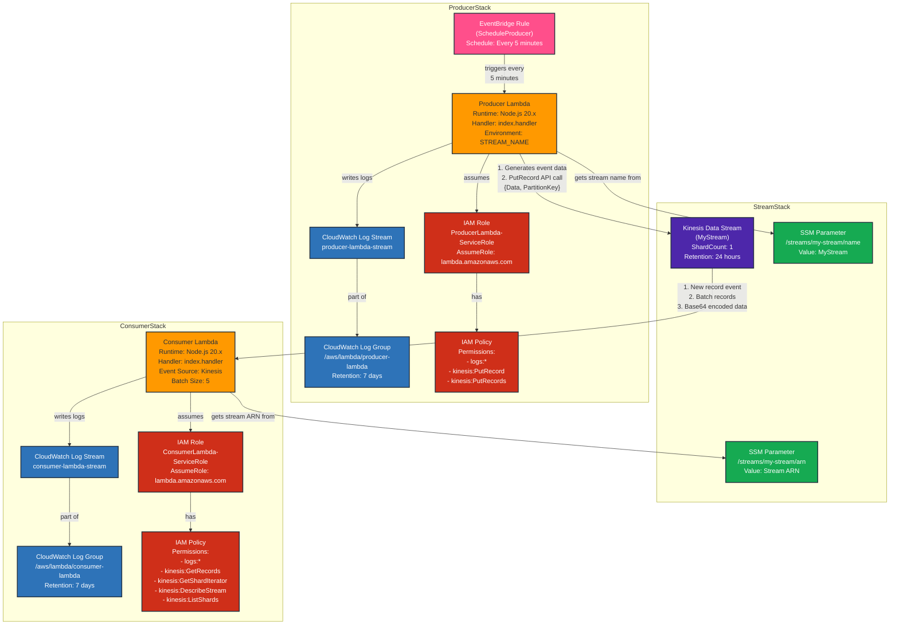

# AWS Kinesis Infrastructure Project

This project is a fully featured AWS infrastructure setup for streaming data processing using Kinesis. It uses a monorepo structure with AWS CDK to define and deploy all resources.

## Table of Contents

- [Architecture](#architecture)
  - [Data Flow Architecture](#data-flow-architecture)
- [Prerequisites](#prerequisites)
- [AWS Configuration Requirements](#aws-configuration-requirements)
  - [AWS CLI Setup](#aws-cli-setup)
  - [Required AWS Permissions](#required-aws-permissions)
  - [AWS CDK Bootstrap](#aws-cdk-bootstrap)
  - [AWS Region Considerations](#aws-region-considerations)
- [Getting Started](#getting-started)
  - [1. Clone the Repository](#1-clone-the-repository)
  - [2. Install Dependencies](#2-install-dependencies)
  - [3. Build the Project](#3-build-the-project)
  - [4. Deploy the Infrastructure](#4-deploy-the-infrastructure)
- [Project Structure](#project-structure)
- [Monorepo with Turborepo](#monorepo-with-turborepo)
  - [How Turborepo Binds the Projects](#how-turborepo-binds-the-projects)
  - [Dependency Graph](#dependency-graph)
  - [Caching and Performance](#caching-and-performance)
- [Available Scripts](#available-scripts)
  - [Build Commands](#build-commands)
  - [Deployment Commands](#deployment-commands)
  - [Cleanup Commands](#cleanup-commands)
- [Lambda Functions](#lambda-functions)
  - [Producer Lambda](#producer-lambda)
  - [Consumer Lambda](#consumer-lambda)
- [Sample CloudWatch Logs](#sample-cloudwatch-logs)
  - [Producer Lambda Logs](#producer-lambda-logs)
  - [Consumer Lambda Logs](#consumer-lambda-logs)
- [Customization](#customization)
  - [Modifying the Stream](#modifying-the-stream)
  - [Customizing the Producer](#customizing-the-producer)
  - [Customizing the Consumer](#customizing-the-consumer)
- [Observability](#observability)
- [Cleanup](#cleanup)
- [Troubleshooting](#troubleshooting)
  - [Lambda Module Errors](#lambda-module-errors)
  - [Permission Issues](#permission-issues)
  - [Deployment Failures](#deployment-failures)
- [License](#license)

## Architecture

The project implements a complete streaming data pipeline with three main components:

1. **Stream**: A Kinesis Data Stream that serves as the backbone for data flow
2. **Producer**: A Lambda function that generates and sends data to the Kinesis stream
3. **Consumer**: A Lambda function that processes data from the Kinesis stream

Each component is defined as a separate AWS CDK stack for independent deployment and management.

### Data Flow Architecture



## Prerequisites

- Node.js v18 or higher
- npm v10 or higher
- AWS CLI configured with appropriate credentials
- AWS CDK v2 installed globally (optional, but recommended)

## AWS Configuration Requirements

### AWS CLI Setup

This project requires a properly configured AWS CLI with valid credentials to deploy and run the infrastructure. Follow these steps to set up your AWS environment:

1. **Install AWS CLI**: If not already installed, download and install the [AWS CLI](https://aws.amazon.com/cli/).

2. **Configure AWS Credentials**: Run the following command and provide your AWS access key, secret key, default region, and output format:
   ```bash
   aws configure
   ```

3. **Verify Configuration**: Ensure your credentials are working correctly:
   ```bash
   aws sts get-caller-identity
   ```

### Required AWS Permissions

The AWS user or role used for deployment needs these permissions:
- CloudFormation: Full access to create, update, and delete stacks
- IAM: Create roles and policies
- Lambda: Create and manage functions
- Kinesis: Create and manage streams
- CloudWatch: Create log groups and set up event rules
- SSM: Create and manage parameters

### AWS CDK Bootstrap

If you haven't used CDK in your AWS account/region before, you'll need to bootstrap CDK:
```bash
npx cdk bootstrap aws://YOUR_ACCOUNT_NUMBER/YOUR_REGION
```

### AWS Region Considerations

This project can be deployed to any AWS region that supports all the required services (Lambda, Kinesis, etc.). The region is determined by your AWS CLI configuration or environment variables.

## Getting Started

### 1. Clone the Repository

```bash
git clone <repository-url>
cd kinesis-producer-consumer
```

### 2. Install Dependencies

```bash
npm install
```

### 3. Build the Project

Build all infrastructure components and Lambda functions:

```bash
npm run build
npm run build:lambda:all
```

### 4. Deploy the Infrastructure

Deploy all components in the correct order:

```bash
# Deploy the stream first
npm run deploy:stream

# Then deploy the producer
npm run deploy:producer

# Finally deploy the consumer
npm run deploy:consumer

# Or deploy everything at once
npm run deploy
```

## Project Structure

```
kinesis-producer-consumer/
├── packages/
│   ├── infra/
│   │   ├── stream/             # Kinesis stream infrastructure
│   │   │   ├── src/
│   │   │   │   └── main.ts     # CDK stack definition
│   │   │   └── tsconfig.json
│   │   ├── producer/           # Producer Lambda infrastructure
│   │   │   ├── lambda/         # Lambda function code
│   │   │   │   └── index.ts    # Lambda handler
│   │   │   ├── src/
│   │   │   │   └── main.ts     # CDK stack definition
│   │   │   └── tsconfig.json
│   │   └── consumer/           # Consumer Lambda infrastructure
│   │       ├── lambda/         # Lambda function code
│   │       │   └── index.ts    # Lambda handler
│   │       ├── src/
│   │       │   └── main.ts     # CDK stack definition
│   │       └── tsconfig.json
│   └── shared/                 # Shared code and types
│       └── types/
│           └── src/            # Shared TypeScript types
├── tsconfig.json               # Root TypeScript configuration
├── turbo.json                  # Turborepo configuration
└── package.json                # Project scripts and dependencies
```

## Monorepo with Turborepo

This project uses Turborepo to manage the monorepo structure and orchestrate the build process across multiple packages.

### How Turborepo Binds the Projects

Turborepo binds the different packages together through several key files:

1. **turbo.json**: The central configuration file that defines:
   - Task dependencies (what needs to build before what)
   - Caching rules
   - Inputs and outputs for each task

   ```json
   {
     "$schema": "https://turborepo.com/schema.json",
     "tasks": {
       "build": {
         "dependsOn": ["^build"],
         "inputs": ["$TURBO_DEFAULT$", ".env*"],
         "outputs": [".next/**", "!.next/cache/**"]
       },
       "lint": {
         "dependsOn": ["^lint"]
       },
       "check-types": {
         "dependsOn": ["^check-types"]
       }
     }
   }
   ```

2. **package.json Workspaces**: The root package.json defines workspaces that tell npm which packages are part of the monorepo:

   ```json
   "workspaces": [
     "packages/*"
   ]
   ```

3. **Root tsconfig.json**: Provides base TypeScript configuration and path aliases for importing between packages:

   ```json
   {
     "compilerOptions": {
       "paths": {
         "@shared/types": ["packages/shared/types/src"]
       }
     }
   }
   ```

4. **Package References**: Packages can reference each other through standard npm dependencies, which Turborepo resolves locally:

   ```json
   "dependencies": {
     "@shared/types": "*"
   }
   ```

### Dependency Graph

The `^` symbol in the `dependsOn` field of turbo.json indicates that a task depends on the same task in all of its dependencies. For example, if consumer depends on shared-types, then consumer's build task will wait for shared-types' build task to complete first.

This ensures that packages are built in the correct order, with dependencies built before the packages that use them.

### Caching and Performance

Turborepo intelligently caches task outputs, dramatically speeding up subsequent builds. If a package hasn't changed, Turborepo will reuse the cached output instead of rebuilding it.

## Available Scripts

### Build Commands

```bash
# Build all infrastructure code
npm run build

# Build individual components
npm run build:stream
npm run build:producer
npm run build:consumer

# Build Lambda functions
npm run build:lambda:producer
npm run build:lambda:consumer
npm run build:lambda:all
```

### Deployment Commands

```bash
# Deploy all stacks
npm run deploy

# Deploy individual stacks
npm run deploy:stream
npm run deploy:producer
npm run deploy:consumer
```

### Cleanup Commands

```bash
# Destroy all stacks
npm run destroy

# Destroy individual stacks
npm run destroy:consumer
npm run destroy:producer
npm run destroy:stream
```

## Lambda Functions

### Producer Lambda

The producer Lambda function runs on a schedule (every 5 minutes) and generates sample data to send to the Kinesis stream.

Key features:
- Uses AWS SDK v3 for Kinesis
- Configured with CloudWatch logs
- Automatically retrieves stream name from SSM Parameter Store

### Consumer Lambda

The consumer Lambda function is triggered by new records in the Kinesis stream and processes the incoming data.

Key features:
- Event-driven architecture with Kinesis triggers
- Configured with CloudWatch logs
- Processes batches of records from the stream

## Sample CloudWatch Logs

This section shows sample CloudWatch logs from both Lambda functions in operation, demonstrating the data flow from producer to consumer.

### Producer Lambda Logs

The following logs show the producer Lambda function generating and sending events to the Kinesis stream every 5 minutes:

```
INIT_START Runtime Version: nodejs:20.v65	Runtime Version ARN: arn:aws:lambda:us-east-1::runtime:3cc38a00649d3324b5761bccca5fb52a862c8db1c1b85f796b7692836ee6baef
START RequestId: 6663a27c-3105-4f8d-8459-80ea855734c6 Version: $LATEST
2025-06-02T11:49:25.199Z	6663a27c-3105-4f8d-8459-80ea855734c6	INFO	Producer sent: { message: 'Hello', time: 1748864964227 }
END RequestId: 6663a27c-3105-4f8d-8459-80ea855734c6
REPORT RequestId: 6663a27c-3105-4f8d-8459-80ea855734c6	Duration: 1034.62 ms	Billed Duration: 1035 ms	Memory Size: 128 MB	Max Memory Used: 81 MB	Init Duration: 276.53 ms	
START RequestId: da9e825d-23bf-4e52-917e-03bbfd2766b8 Version: $LATEST
2025-06-02T11:51:22.578Z	da9e825d-23bf-4e52-917e-03bbfd2766b8	INFO	Producer sent: { message: 'Hello', time: 1748865082098 }
END RequestId: da9e825d-23bf-4e52-917e-03bbfd2766b8
REPORT RequestId: da9e825d-23bf-4e52-917e-03bbfd2766b8	Duration: 501.64 ms	Billed Duration: 502 ms	Memory Size: 128 MB	Max Memory Used: 81 MB	
START RequestId: 7edd14e7-9428-4956-9e60-4efa6fe75093 Version: $LATEST
2025-06-02T11:56:22.562Z	7edd14e7-9428-4956-9e60-4efa6fe75093	INFO	Producer sent: { message: 'Hello', time: 1748865382118 }
END RequestId: 7edd14e7-9428-4956-9e60-4efa6fe75093
REPORT RequestId: 7edd14e7-9428-4956-9e60-4efa6fe75093	Duration: 540.51 ms	Billed Duration: 541 ms	Memory Size: 128 MB	Max Memory Used: 81 MB	
START RequestId: b71279cd-3320-4f90-848b-c93a65cf3aac Version: $LATEST
2025-06-02T12:01:22.219Z	b71279cd-3320-4f90-848b-c93a65cf3aac	INFO	Producer sent: { message: 'Hello', time: 1748865682024 }
END RequestId: b71279cd-3320-4f90-848b-c93a65cf3aac
REPORT RequestId: b71279cd-3320-4f90-848b-c93a65cf3aac	Duration: 235.09 ms	Billed Duration: 236 ms	Memory Size: 128 MB	Max Memory Used: 81 MB	
```

From these logs, you can observe:
- The Lambda cold start time (Init Duration: 276.53 ms)
- Regular execution approximately every 5 minutes
- The message content being sent to Kinesis
- Performance metrics for each invocation

### Consumer Lambda Logs

The following logs show the consumer Lambda function being triggered by new records in the Kinesis stream and processing them:

```
INIT_START Runtime Version: nodejs:20.v65	Runtime Version ARN: arn:aws:lambda:us-east-1::runtime:3cc38a00649d3324b5761bccca5fb52a862c8db1c1b85f796b7692836ee6baef
START RequestId: 7046b8c4-ce02-4e5d-ae94-9ce3cfb6d391 Version: $LATEST
2025-06-02T11:52:14.028Z	7046b8c4-ce02-4e5d-ae94-9ce3cfb6d391	INFO	Consumer received: { message: 'Hello', time: 1748864964227 }
END RequestId: 7046b8c4-ce02-4e5d-ae94-9ce3cfb6d391
REPORT RequestId: 7046b8c4-ce02-4e5d-ae94-9ce3cfb6d391	Duration: 70.30 ms	Billed Duration: 71 ms	Memory Size: 128 MB	Max Memory Used: 68 MB	Init Duration: 138.24 ms	
START RequestId: e8f86922-b028-4146-ac07-6dea389353eb Version: $LATEST
2025-06-02T11:52:14.109Z	e8f86922-b028-4146-ac07-6dea389353eb	INFO	Consumer received: { message: 'Hello', time: 1748865082098 }
END RequestId: e8f86922-b028-4146-ac07-6dea389353eb
REPORT RequestId: e8f86922-b028-4146-ac07-6dea389353eb	Duration: 1.80 ms	Billed Duration: 2 ms	Memory Size: 128 MB	Max Memory Used: 68 MB	
START RequestId: daa5f3f4-ed2c-470a-b163-7cee29e6edee Version: $LATEST
2025-06-02T11:56:23.469Z	daa5f3f4-ed2c-470a-b163-7cee29e6edee	INFO	Consumer received: { message: 'Hello', time: 1748865382118 }
END RequestId: daa5f3f4-ed2c-470a-b163-7cee29e6edee
REPORT RequestId: daa5f3f4-ed2c-470a-b163-7cee29e6edee	Duration: 24.88 ms	Billed Duration: 25 ms	Memory Size: 128 MB	Max Memory Used: 68 MB	
START RequestId: 7f549a34-5ef7-471f-a170-a1ce34ff84a0 Version: $LATEST
2025-06-02T12:01:22.531Z	7f549a34-5ef7-471f-a170-a1ce34ff84a0	INFO	Consumer received: { message: 'Hello', time: 1748865682024 }
END RequestId: 7f549a34-5ef7-471f-a170-a1ce34ff84a0
REPORT RequestId: 7f549a34-5ef7-471f-a170-a1ce34ff84a0	Duration: 21.10 ms	Billed Duration: 22 ms	Memory Size: 128 MB	Max Memory Used: 68 MB	
```

From these logs, you can observe:
- The consumer Lambda processing each record shortly after it's produced
- The same message content that was sent by the producer
- Significantly faster processing times compared to the producer (typically < 25ms)
- Lower memory usage compared to the producer

These logs demonstrate the complete data flow through the Kinesis stream, from the producer generating messages to the consumer processing them.

## Customization

### Modifying the Stream

Edit `packages/infra/stream/src/main.ts` to change:
- Stream name
- Shard count
- Retention period
- Other Kinesis stream properties

### Customizing the Producer

1. Edit `packages/infra/producer/lambda/index.ts` to change the data being sent
2. Edit `packages/infra/producer/src/main.ts` to modify:
   - Schedule frequency
   - Lambda configuration
   - IAM permissions

### Customizing the Consumer

1. Edit `packages/infra/consumer/lambda/index.ts` to change how data is processed
2. Edit `packages/infra/consumer/src/main.ts` to modify:
   - Batch size
   - Starting position
   - Lambda configuration
   - IAM permissions

## Observability

All Lambda functions are configured with CloudWatch logs for monitoring and debugging:

- Log groups have a retention period of 7 days
- Custom log streams are created for each Lambda
- All necessary IAM permissions are configured automatically

## Cleanup

To avoid incurring charges, destroy all resources when they're no longer needed:

```bash
# Destroy everything
npm run destroy

# Or destroy components individually
npm run destroy:consumer
npm run destroy:producer
npm run destroy:stream
```

## Troubleshooting

### Lambda Module Errors

If you encounter Lambda module errors:

1. Make sure Lambda functions are properly built:
   ```bash
   npm run build:lambda:all
   ```

2. Check the Lambda deployment directory structure:
   ```
   lambda/dist/index.js
   ```

### Permission Issues

If you encounter permission issues:
1. Verify your AWS credentials
2. Check IAM roles and policies in the CDK stacks
3. Ensure that proper permissions are granted to the Lambda functions

### Deployment Failures

If deployment fails:
1. Check CloudFormation console for detailed error messages
2. Verify that all prerequisites are installed
3. Make sure all TypeScript code compiles without errors

## License

[MIT](LICENSE)
